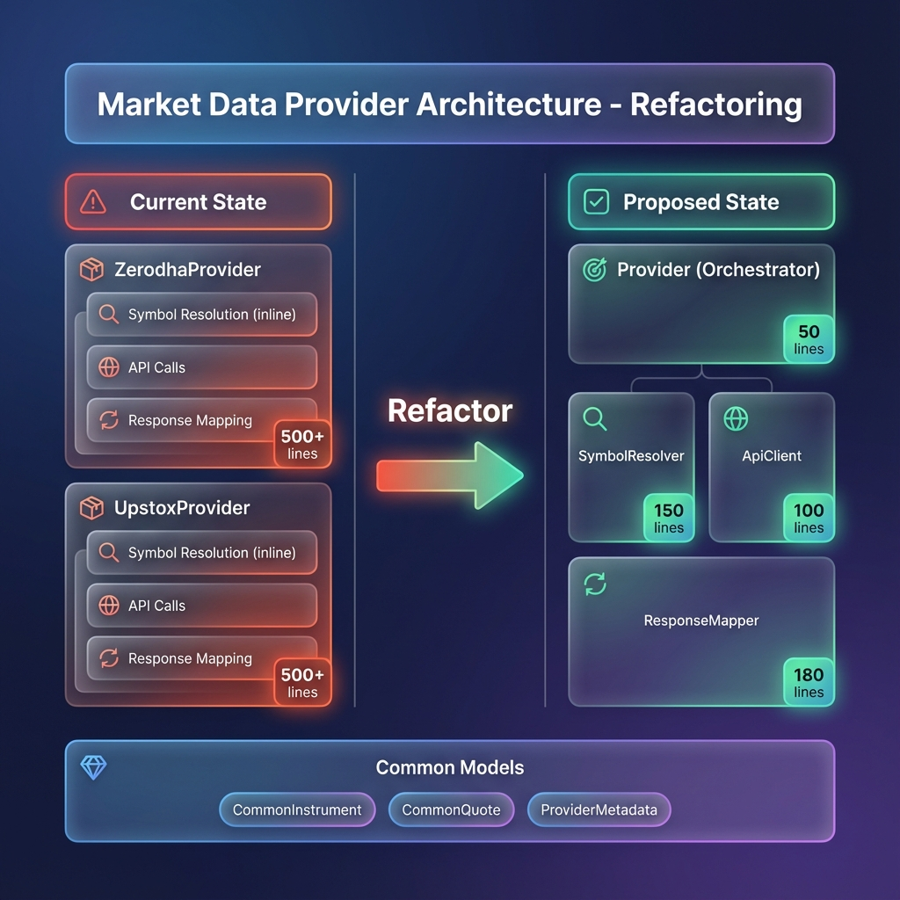
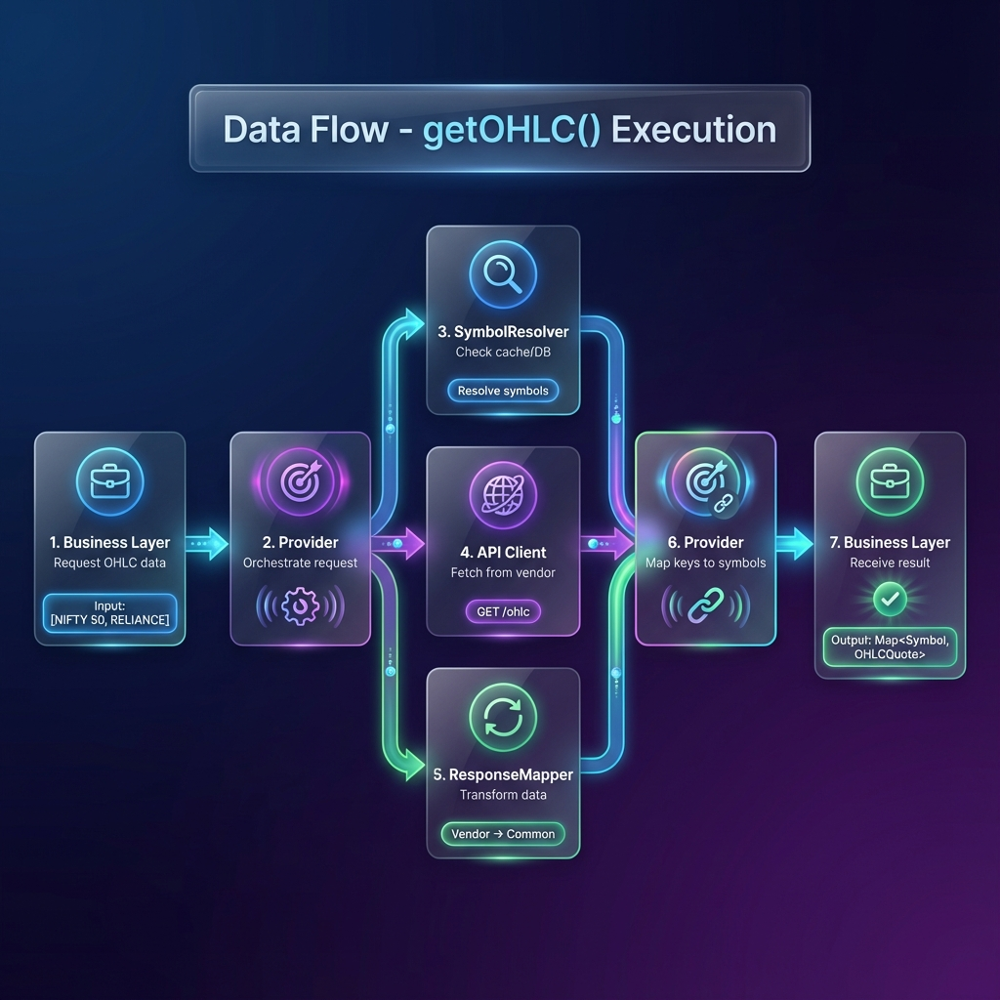
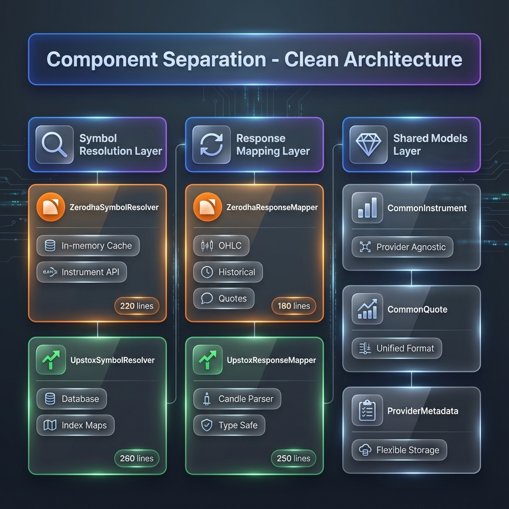

# Market Data Provider Architecture

## Overview

This document describes the refactoring of the Market Data Provider architecture to achieve clean separation of concerns.

## Architecture Diagrams

### Before → After Comparison

**Key Transformation**:
- **Before**: Monolithic provider with inline logic (500+ lines)
- **After**: Orchestrator pattern with injected components (< 200 lines each)

### Data Flow

**Execution Path**: Request → Resolve → Fetch → Map → Return

### Component Separation

**Three Independent Layers**:
- 🔍 **Symbol Resolution**: Provider-specific resolvers (cache vs DB)
- 🔄 **Response Mapping**: Vendor response transformers
- 💎 **Common Models**: Shared provider-agnostic models

## Design Principles

1. **Separation of Concerns**: Each component has a single, well-defined responsibility
2. **Dependency Injection**: Components are injected rather than created internally
3. **Provider Agnostic**: Common models eliminate vendor lock-in
4. **Testability**: Each component can be tested in isolation
5. **Maintainability**: < 200 lines per component

## Components

### Symbol Resolvers

**Purpose**: Resolve trading symbols to provider-specific instrument identifiers

- `ZerodhaSymbolResolver`: In-memory cache from Zerodha API
- `UpstoxSymbolResolver`: Database lookup + index identifier

### Response Mappers

**Purpose**: Transform vendor-specific responses to common models

- `ZerodhaResponseMapper`: Consolidates existing OHLCMapper and HistoryDataMapper
- `UpstoxResponseMapper`: Extracted from 100+ lines of inline code

### Common Models

**Purpose**: Provider-agnostic data structures

- `CommonInstrument`: Standardized instrument representation
- `CommonQuote`: Unified quote/price data
- `ProviderMetadata`: Flexible provider-specific storage

## Implementation Status

- [x] Phase 1: Common Models
- [x] Phase 2: Symbol Resolvers
- [x] Phase 3: Response Mappers
- [ ] Phase 4: Provider Integration
- [ ] Phase 5: Interface Update
- [ ] Phase 6: Configuration & Testing
