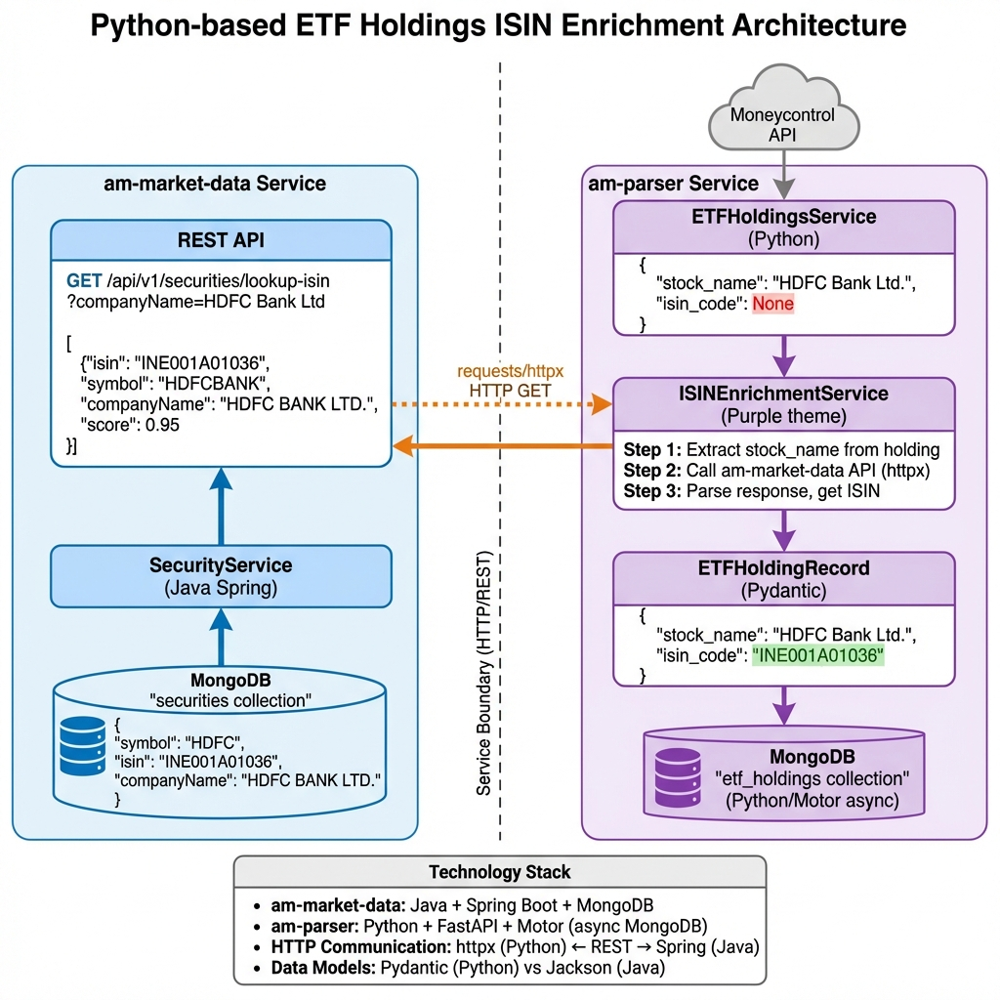

# ETF Holdings ISIN Enrichment

> **Service**: am-parser (Python)  
> **Dependency**: am-market-data REST API  
> **Purpose**: Enrich ETF holdings with ISIN numbers for portfolio analytics

---

## Quick Links

- 📋 [Implementation Plan](./IMPLEMENTATION_PLAN.md) - Comprehensive technical plan
- 🖼️ [Architecture Diagram](./architecture.png) - Visual flow
- 📊 [Verification Steps](./IMPLEMENTATION_PLAN.md#verification) - Testing guide

---

## Problem

ETF holdings fetched from Moneycontrol API lack ISIN numbers:

```python
{
    "stock_name": "HDFC Bank Ltd.",
    "isin_code": None  # ❌ Missing!
}
```

## Solution

Call am-market-data lookup API to get ISIN by company name:

```python
# 1. Fetch holdings from Moneycontrol
holdings = await service.fetch_holdings_from_api(etf_isin)

# 2. Enrich with ISIN
enriched = await enrichment.enrich_holdings_batch(holdings)

# 3. Save to MongoDB
await service.store_holdings(enriched_holdings_data)
```

---

## Architecture



---

## Quick Start

### 1. Test API Connection
```bash
curl "http://localhost:8020/api/v1/securities/lookup-isin?companyName=HDFC%20Bank"
```

### 2. Run Enrichment (Dry Run)
```bash
cd am-parser
python -m scripts.enrich_existing_holdings --limit 10 --dry-run
```

### 3. Execute Enrichment
```bash
python -m scripts.enrich_existing_holdings --limit 100
```

---

## Configuration

```bash
# .env
AM_MARKET_DATA_URL=http://localhost:8020
ISIN_MIN_CONFIDENCE=0.85
```

---

## Timeline

- Implementation: 4 days
- Testing: 1 day
- **Total**: 5 days

---

## Success Metrics

- ✅ >90% holdings enriched with ISIN
- ✅ <500ms avg API response time
- ✅ Zero data corruption
