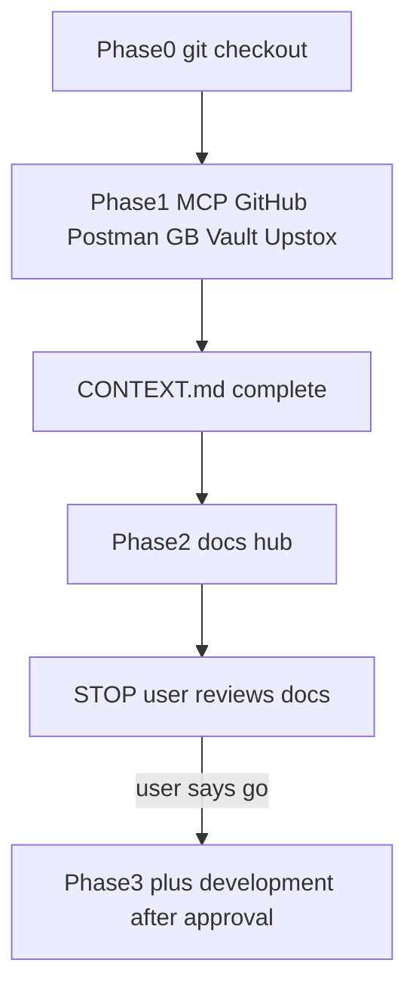
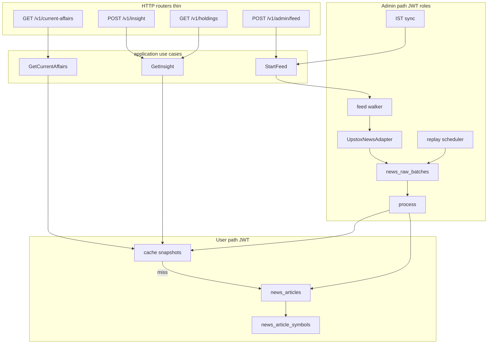
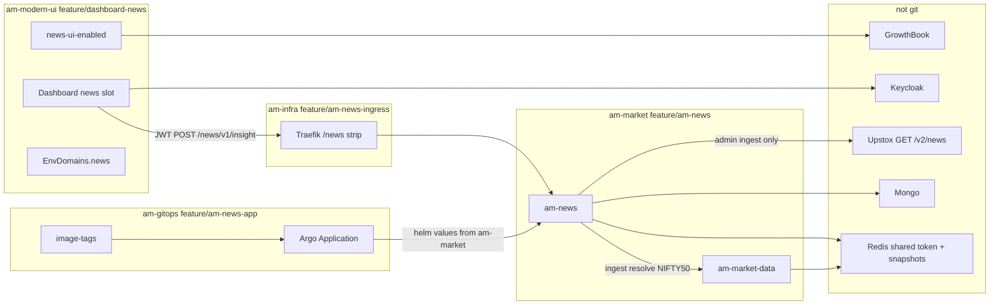

# AM News living plan

v0 is news, not a spread across Portfolio / Market / Trade. One job: ingest news, serve it quickly on the home dashboard.

Phase 0 (branches) and Phase 1 (MCP) are recorded in [CONTEXT.md](./CONTEXT.md). This hub is the first execute slice. Development (FastAPI, UI, Helm, prod feed) starts only after review in chat.

Two feeds, never mixed:

- **Current affairs** — last 10 articles from the NIFTY 50 universe, same for everyone (`news:affairs:v1`)
- **Your holdings** — only the user’s symbols, recent first, no extras (`news:holdings:v1:{sha1}`)

Read path never calls Upstox or am-market-data. Resolver and vendor HTTP exist only on the ingest worker.

## Git docs under feature name `am-news`

Living docs are git-tracked. Same idea as [am-market-data/docs/etf-enrichment](../../../am-market-data/docs/etf-enrichment/IMPLEMENTATION_PLAN.md).

Canonical hub (this directory, `feature/am-news`):

```text
am-market/am-news/docs/am-news/
  CONTEXT.md
  README.md
  PLAN.md
  TODO.md
  architecture.drawio
  cross-repo.drawio
```

Thin pointers (one README each, link back here):

- am-modern-ui `docs/am-news/README.md` on `feature/dashboard-news`
- am-infra `docs/am-news/README.md` on `feature/am-news-ingress`
- am-gitops `docs/am-news/README.md` on `feature/am-news-app`

Open `.drawio` in diagrams.net / VS Code Draw.io. Keep mermaid copies below so GitHub review still works without the plugin.

Execute order (do not skip):

1. Git checkout (Phase 0) — done
2. MCP prerequisites until CONTEXT.md is complete (Phase 1) — done, with N/A rows called out in CONTEXT
3. Write the docs hub (Phase 2) — this directory
4. **STOP.** User reviews this hub
5. Development (Phase 3+) starts only after that review is approved in chat



## Feature flag: ON for now (except production)

GrowthBook key `news-ui-enabled`. Env ids: `dev`, `preprod`, `production`, `spt` (not `prod`).

Phase 1 could not create the flag (GrowthBook MCP needs a datasource). Create it in the UI after approval. Intended states:

- Local / SDK down: `newsUiEnabledProvider` uses `isOn(..., defaultValue: true)` only when the app flavor is local, `dev`, or `preprod`
- Production flavor: `defaultValue: false` so a GrowthBook timeout cannot flash news on prod
- GrowthBook `dev` + `preprod`: force ON
- GrowthBook `production` + `spt`: force OFF
- Flag off: no news slot, no calls to `/v1/insight` or `/v1/current-affairs`

## Hard split: user vs admin

Modern UI and user news APIs talk to Redis and Mongo only. Never Upstox on cache miss. Empty news is an empty list.

- Flutter `NewsRepository`, `GET /v1/current-affairs` and `POST /v1/insight`: Redis snapshots, `news_articles`
- Admin `POST /v1/admin/feed/*`, sync: Upstox GET, persist raw, process, Redis warm
- Process scheduler parses stored `body` only

Auth: no anonymous news. User JWT or 401. Admin: `admin` / `super_admin` via `am_platform_security.require_any_roles` (copy am-identity admin_router). Flutter never calls admin. Prod Keycloak `am-realm` currently has `admin` and not `super_admin` (see CONTEXT).

Public URL: Traefik prefix `/news` (product resource, not the Helm name `am-news`). After strip, FastAPI paths are `/v1/...` with no service segment. Public example: `https://{host}/news/v1/current-affairs`. Never `/am-news/...`, `/news-service/...`, or `/news/v1/news/...`. Admin: `/v1/admin/feed/start` on the same host behind JWT roles in v0.

## Draw.io: in-repo architecture (`architecture.drawio`)

Page name: `am-news in-repo`. Boxes:

- Thin HTTP routers (`current_affairs`, `insight`, `holdings`) -> application use cases -> `cache/snapshots` -> Redis keys `news:affairs:v1` and `news:holdings:v1:{sha1}`; miss -> `news_articles` + `news_article_symbols`. No arrow to Upstox. Routers do not import adapters
- Thin `admin` routers -> `StartFeed` / `ReplayRaw` use cases -> `feed/` -> `UpstoxNewsAdapter` -> `news_raw_batches.body` -> `process/` -> articles + Redis
- `scheduler/replay` claims pending/failed raw rows, parse body only
- `scheduler/sync` IST 30m calls in-process `start_feed()`, same feed lock
- Ports: `NewsFetchPort` + `NewsParsePort`. Tests: `FakeNewsProvider`



## Draw.io: cross-repo collaboration (`cross-repo.drawio`)

Page name: `cross-repo`. Who owns what; arrows are runtime or git, labeled.



Rules on the diagram (as notes):

- UI never talks to Upstox or `/v1/admin`. Public paths have no `am-news` service segment
- am-news user path never talks to am-market-data
- Helm values: am-market. Image tags + Application YAML: am-gitops. Ingress: am-infra
- Same Redis as market-data for `market_data:upstox:access_token`

## Latency (v0)

- `GET /v1/current-affairs` p95 under 50ms cached
- `POST /v1/insight` p95 under 100ms
- News widget must not delay Summary / movers. Parallel Future. Skeleton then cards

Cache-Control: `private, max-age=30`. Do not use `public` while JWT is required.

v0 universe: NIFTY 50 keys, batches of 30. Snapshots: affairs TTL 120s, holdings TTL 60s. Cache miss: Mongo projection + limit, never Upstox.

## Ingest: persist then process

`news_raw_batches` keeps the full vendor JSON. Fetch ok + body: never call the vendor again for that row. Process failures keep body, backoff, then `dead`. Replay scheduler claims pending/failed, parses body, upserts, refreshes Redis.

Admin resource paths (no service name): `POST /v1/admin/feed/start|stop`, `GET /v1/admin/feed`, `GET /v1/admin/raw`, `POST /v1/admin/replay` and `POST /v1/admin/replay/{raw_id}` (body only). One feed lock; second HTTP start -> 409; cron overlap -> skip.

Sync: `NEWS_SYNC_ENABLED=1`, every 30 min 09:00–16:00 IST (`zoneinfo Asia/Kolkata`) plus 08:30 and 18:00. Token: Redis `market_data:upstox:access_token`. Missing -> `token_missing`, no vendor HTTP.

Vendor parse facts from Phase 1 (CONTEXT): `data` is keyed by instrument key; article fields are `heading`, `summary`, `thumbnail`, `article_link`, `published_time`. Python default User-Agent is Cloudflare 1010; adapter must send a browser-like User-Agent. Tolerate missing keys in `data`. Unique `(provider, article_uid)` with `article_uid` = vendor id or SHA-256 of `article_link`. Child `news_article_symbols` `(article_id, symbol, isin, instrument_key)`.

## Routes, OpenAPI enrich, Postman (no service in the path)

Gateway strip `/news` is the product prefix. The Helm/K8s name stays `am-news`; it must not appear in HTTP paths. App `root_path` is empty after strip.

- Public `GET /news/v1/current-affairs` -> FastAPI `GET /v1/current-affairs` (tag Current affairs, `getCurrentAffairs`)
- Public `POST /news/v1/insight` -> `POST /v1/insight` (tag Insight, `postInsight`)
- Public `GET /news/v1/holdings` -> `GET /v1/holdings` (tag Holdings, `getHoldings`) — Postman/debug only. Flutter v0 uses `POST /v1/insight` only
- Public `POST /news/v1/admin/feed/start` -> `POST /v1/admin/feed/start` (tag Admin, `startFeed`)

Forbidden path shapes: `/v1/am-news/...`, `/v1/news-service/...`, `/v1/news/current-affairs` (doubled resource).

Enrich so Swagger is the docs. FastAPI `/openapi.json` is the contract. Every operation has:

- Stable `operation_id`, `summary`, `description`
- Named Pydantic `response_model` / body (`CurrentAffairsResponse`, `InsightRequest`, `InsightResponse`, `NewsCard`, `ErrorEnvelope`). No `dict`, no anonymous `object`
- `Field(description=..., examples=...)`; symbols are `string` + example `RELIANCE`, not an enum
- Closed codes as enums (`ProcessStatus`, `FeedStatus`)
- Declared 401/403/409 with `ErrorEnvelope` (`error_code`, `message`, `details`)
- Bearer JWT security scheme; `info.title` = `AM News`, `info.version` set
- `Cache-Control` documented as a header on 200s

Postman is generated from that spec, not a second hand-written contract:

- `am-news/postman/AM-News.postman_collection.json` imported from `/openapi.json`
- Folders = OpenAPI tags (Current affairs, Insight, Holdings, Admin)
- Collection vars: `news_base_url` (prod default `https://am.asrax.in/news`; prerequest maps `platform_env` / `am_env`), `identity_base_url`, `access_token` (same Identity login capture)
- Separate vendor collection `Upstox News (AM ingest)` stays vendor-only (see CONTEXT). Product collection is not hand-written in Phase 1
- Test: `tests/test_openapi_schema.py` fails if a 2xx lacks a named schema or `operationId`

Clear separation, reusable code. Routers stay HTTP-only (status, Depends, DTO in/out). They never import Upstox, Mongo, or Redis.

```text
am_news/
  api/routes/          # thin: current_affairs, insight, holdings, admin_feed, admin_replay
  api/deps.py          # JWT user vs admin/super_admin
  schemas/             # OpenAPI DTOs only (not Mongo documents)
  application/         # GetCurrentAffairs, GetInsight, StartFeed, ReplayRaw
  domain/              # ports NewsFetchPort NewsParsePort, entities
  adapters/            # upstox, mongo, redis, market-data (ingest only)
```

Reuse (one implementation, many routes):

- `GetInsight` serves both `POST /v1/insight` and `GET /v1/holdings`
- Snapshot reader shared by current-affairs and insight
- `ErrorEnvelope` mapper once
- `NewsCard` schema shared across all list responses

Empty symbols -> `holdings: []`, still return current affairs on insight if present. Cap 80 symbols.

## Flutter v0: one dashboard slot, flag on by default locally

Route `/app/dashboard`. Add `DashboardWidgetId.news` to defaultDashboardLayout so `mergeWithDefaultLayout` inserts it.

Holdings symbols: unique tickers from the existing portfolio holdings call (`PortfolioEndpoints.userHoldings()`), cap 80, then `POST /v1/insight`. Do not use `moversStreamProvider`. am-news never calls am-portfolio. If holdings fetch fails or is empty, POST empty `symbols` (current affairs still shows). Do not treat NIFTY 50 as holdings.

Wire `dashboardParallelKickoff` when the news slot is visible. Kick holdings fetch in parallel with Summary; do not await it before painting KPIs.

URLs: `EnvDomains.news` -> `$apiBase/news` and `NewsApiConfig` on `AppConfig` / `ConfigService`. Client timeout ~800ms.

Out of v0: Portfolio/Market/Trade strips, stock detail, new bottom nav.

## Production (amctl + cluster)

Copy Helm/vault from am-parser. JWT/OIDC like am-identity. Instrument search OAuth like parser `service-oauth`.

- Add `am-news` to `direct-deploy.yml` and add `dev` to environment choices
- Path-filtered CI `.github/workflows/am-news.yml` like `market-parser.yml`
- am-infra: add `/news` to all three strip lists: `k8s/dev-middlewares.yaml` (`dev-strip-prefix`), `k8s/ingress-routing.yaml` (preprod), `k8s/prod-middlewares.yaml`. Ingress path `/news` -> Service `am-news` in each env
- Vault Redis URI for am-news must be the same Redis as am-market-data so `market_data:upstox:access_token` is readable
- Disable or admin-gate `/docs` and `/openapi.json` in prod values. Leave them on for local/dev
- Merge order for code: laptop `am test` green, then Helm/ingress/gitops, then Phase 4 prod deploy (namespace `am-apps-prod`, VPS `am-vps-prod`, Helm release `am-news` bare). UI flag stays OFF on GrowthBook `production` so users do not see the slot until Phase 5
- am-gitops: `prod/apps/am-news.yaml` + `prod/image-tags/am-news.yaml` (mirror `prod/apps/am-parser.yaml`; destination namespace `am-apps-prod`). Also enroll dev/preprod apps
- `/health` and `/ready`. OpenAPI named DTOs. Prod: no public `/docs` (or admin-only)
- From `am-news`: `am run`, `am test`, `am deploy doctor --env prod`, then `am deploy --env prod` (or Argo sync after image tag bump). Pods from Vault

Laptop `am run` does not need ingress. Cluster verify does.

## Phase 4: prod VPS deploy, then admin NIFTY 50 feed

Do this after the service exists and `am test` is green. Do not skip local tests and ship an empty image.

Target: cluster am-vps-prod, namespace `am-apps-prod`, public prefix `https://am.asrax.in/news` (Traefik strip `/news`).

Prereqs on prod: `/news` on prod-middlewares, Ingress backend Service `am-news`, Vault mappings (mongo, same Redis as prod am-market-data, OIDC), Argo Application `am-news-prod`, image tag in `prod/image-tags/am-news.yaml`. Confirm `market_data:upstox:access_token` exists on that Redis (otherwise feed status is `token_missing` and we stop).

Admin feed test (Postman AM News, `access_token` from an `admin` login):

1. `GET /news/v1/admin/feed` -> not running, token present
2. `POST /news/v1/admin/feed/start` -> 202. Universe = all NIFTY 50 instrument keys from `news_instrument_cache` (loaded from am-market-data at start). Walker uses batches of 30. Second start while running -> 409
3. Poll `GET /news/v1/admin/feed` until not running. Record `last_sync_at`, `affairs_age_seconds`, `dead_count`, pages fetched
4. `GET /news/v1/admin/raw` -> rows have `body`, `process_status` processed (or failed with body kept)
5. Mongo: `news_articles` + `news_article_symbols` for NIFTY names. Redis: `news:affairs:v1` has `generated_at`
6. User JWT `GET /news/v1/current-affairs` -> 200, cap 10, no raw vendor payload. No JWT -> 401. User JWT `POST /news/v1/admin/feed/start` -> 403
7. User JWT `POST /news/v1/insight` with a few NIFTY symbols (example `RELIANCE`, `TCS`) -> holdings only those names; current affairs still present

If `dead_count > 0`, log `news_raw_dead` and fix before calling the UI done. Do not flip GrowthBook `production` on in this phase.

## Phase 5: full integration

Only after Phase 4 feed has articles in prod Redis/Mongo.

- Flutter dashboard slot, `EnvDomains.news` -> `$apiBase/news`, `POST /v1/insight` with portfolio holdings symbols (cap 80)
- `flutter test` green. News Future must not block Summary
- Hit prod (or the same host the app uses) with a real user JWT: empty holdings still shows current affairs; holdings chips ⊆ request symbols
- GrowthBook: keep `production` OFF. Turn on `dev`/`preprod` for the app flavors. Flip production only after this integration is signed off (separate change)
- Optional: enroll am-news-dev / preprod the same way so those clusters are not orphans

## Test cases

Meaningful tests only. Backend: `am test` from `am-news`. UI: `flutter test` in `am_dashboard_ui` / `am_common`.

Backend: 401/403 matrix; user routes cannot import Upstox or adapters; two keys -> one article + two symbols; replay fixture zero HTTP; 409 lock; empty 200; token_missing; holdings filter; caps 10/15; Redis miss -> Mongo; process fail keeps body; stale lock; TTL declared; Cache-Control is `private`; OpenAPI every 2xx is a named schema with `operationId`; no path contains `am-news` or `news-service`; Cloudflare-safe User-Agent on the adapter.

UI: GB disabled -> `newsUiEnabled` true (non-prod flavors); mocked flag false -> no widget and no fetch; production flavor default false; flag on -> two labeled blocks; skeleton; empty copy; 401 handling; no admin URLs; news Future independent of Summary; holdings chips ⊆ request symbols; layout merge inserts `news`.

Live after green: `am test` + `flutter test` -> deploy am-apps-prod on am-vps-prod -> admin JWT `POST /news/v1/admin/feed/start` (all NIFTY 50, batches of 30) -> status/raw/Mongo/Redis -> user 401 then 200 current-affairs and insight -> then dashboard full integration. GrowthBook `production` stays OFF until that feed is proven.

## Design review (2026-09-06)

Verdict: request-changes on the previous draft; the majors below are now decided. Implementation remains 0 until code exists.

### Blocker (already decided, keep)

- Same story under many instrument keys: `news_articles` unique `(provider, article_uid)` plus child `news_article_symbols`. `article_uid` is vendor id or SHA-256 of `article_link`
- User path never calls Upstox. Empty store is 200 empty

### Major (closed in this review)

- Holdings universe is not movers. UI loads symbols from `PortfolioEndpoints.userHoldings()`, caps 80, `POST /v1/insight`. am-news does not call portfolio
- Production flag must not fail open. `defaultValue: true` only for local/dev/preprod. Production flavor `defaultValue: false`. GB force ON in `dev`/`preprod`, OFF in `production`/`spt`
- Strip `/news` in all three Traefik files (dev, preprod, prod), not only preprod+prod
- Same Redis as am-market-data for the Upstox token key
- GET /v1/holdings is not the Flutter v0 client. Dashboard uses POST insight only. GET stays for Postman/debug
- Prod deploy is after local tests, then admin NIFTY 50 feed on `am-apps-prod`, then UI. GB `production` stays OFF so the slot does not appear for customers during the feed test
- Resource paths have no `am-news` segment. OpenAPI is the contract. Postman is generated. Routers are thin

### Minor

- Nest docs at `am-news/docs/` if `docs/am-news/` feels doubled. Either is fine if README is the index
- Gate `/docs` in prod
- Thumbnail URL only; UI lazy-load

### Test gaps (must have)

Same fixture list as before, plus: OpenAPI named schemas; no `am-news` in paths; production-flavor flag default is false; insight holdings chips come from the portfolio symbol set fixture, not movers.

### Checked vs not verified

- Checked: plan vs Upstox 30-key/7-day API, live 200 envelope field names, Traefik strip copies (dev/preprod/prod still need `/news` added), dashboard catalog/layout merge, am-gitops Application pattern, OpenAPI standards, identity admin JWT
- Not verified: Redis key presence on cluster, NIFTY 50 key list from market-data, holdings JSON symbol field, Ingress host YAML per env after `/news` is added, GrowthBook flag (MCP cannot create it yet)

Do not: new GitHub repo; feed all NSE_EQ; single `symbol` on the article doc; Upstox on the user/UI path; work on `develop`; put `am-news` or business logic in the HTTP route; hand-maintain Postman as a second source of truth; treat movers as the holdings book.
