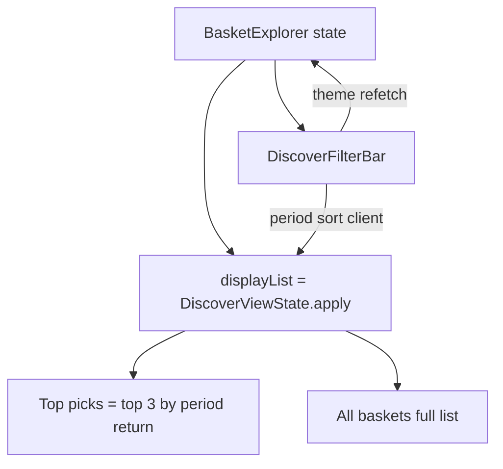

# Discover UI refinement plan (final — 10/10)

**Status:** Implemented in code (2026-09-06) — awaiting manual DoD vs reference  
**Date:** 2026-09-06  
**Scope:** Flutter Smart Baskets → Discover **visual + layout + file split only**  
**Branch:** continue `hotfix/basket-discover-ui`  
**Code root:** `am-modern-ui/am_portfolio_ui/lib/features/basket/presentation/`  
**Reference:** live screenshot (attached in chat) · [basket-design-web.png](./basket-design-web.png) · [basket-mobile-screen.png](./basket-mobile-screen.png)  
**Companion:** [discover-ui-layout-and-todo.md](./discover-ui-layout-and-todo.md) · [TODO.md](./TODO.md) · [smart-baskets-discover-plan.md](./smart-baskets-discover-plan.md)

---

## Senior review of the prior draft plan

### Verdict

**Approve-with-changes.** Prior draft was strong on structure and constraints, weak on ship gates.

### Score: **8 / 10**

| Dimension | Score | Notes |
|-----------|------:|-------|
| Correct constraints (no API / calc change) | 10 | Clear non-goals |
| File split strategy | 9 | Matches `preview/` / `dashboard/` patterns |
| Visual targets | 8 | Good numbers; missing mid-width + sticky-header paths |
| Design-system discipline | 8 | Right tokens; overflow algorithm underspecified |
| Risk / corner cases | 6 | Card overflow, Clear-all+search, chip width guess |
| Test / DoD | 5 | Analyze + eyeball only — not industry-grade |
| Dual mount paths | 5 | `showInlineToggle` true/false not called out |
| Docs as SoT | 6 | Cursor plan only; feature-basket not updated |

### What was missing for 10/10 (now included below)

1. **Definition of Done** with measurable layout numbers and a QA checklist.
2. **Dual chrome paths:** title/toggle inside explorer vs sticky portfolio header (`showInlineToggle`).
3. **Breakpoint matrix:** mobile / tablet / desktop behaviors for cards **and** table.
4. **Overflow algorithm:** measure chips with `TextPainter`, not guessed widths.
5. **Category · Type rule:** never invent `"Equity"` if API has no type field — show `categoryLabel` only.
6. **Clear-all contract** including search field reset API.
7. **Skeleton / empty / error** heights aligned to new card density.
8. **Regression tests** for pure logic (`DiscoverViewState` labels + apply/sort) and layout constants.
9. **Telemetry preservation** (`basket_open_preview`, empty-state events).
10. **PR line-budget gate** (≤600 lines/file) and follow-up list for other long basket files.
11. **This document** as the executable SoT under `docs/feature-basket`.

---

## Non-negotiables

### Keep (do not change)

- Opportunities / catalog APIs and Riverpod providers
- Portfolio match, replica, required ₹, returns, sparkline **data**
- Client period + sort in `DiscoverViewState.apply`
- Theme chip → query refetch; period/sort → no refetch
- Preview routing + `BasketNavigation.openPreview` (CTA label: **Create basket →**)
- Discover / My Baskets toggle + `BasketViewMode`
- Telemetry: `basket_open_preview`, `basket_opportunities_empty`
- No promotional banner
- **Top picks** = top **performers** for the selected period within the current segment (theme/query), not first-N of the table sort

### Defaults locked

| Topic | Decision |
|-------|----------|
| Bookmark / row ⋮ | **Hidden** (no API) |
| Discover CTA | **Create basket →** (still opens preview/create flow via `openPreview`) |
| Top picks | Top 3 by `returnForPeriod(period)`; tie-break `matchScore` |
| Table sorting | **External only** (Discover sort control). Table must not re-sort rows. |
| Category cell | `categoryLabel` as returned; **no fake** `· Equity` |
| All period | Display uses **5Y** series + label `5Y CAGR` |
| File length | Every **new/touched Discover** file ≤ **600** lines |
| Other long files | `my_baskets_view`, `substitute_selector`, `basket_navigation`, `preview_comparison_panels` — **follow-up**, not this change |
| DS | Extend `AppComponentSizes` only for reusable sizes; Discover numbers in `DiscoverLayout` |

---

## Target information architecture

```text
Header (compact)     Smart Baskets + subtitle | [Discover | My Baskets]
Search (48px)        Search ETFs, baskets or themes...
Filter band (tight)  [themes… More] | Performance [1Y][3Y][5Y][All] | Sort | Clear all
Top picks            heading ~36–40px + View all →
                     3 cards = top performers for selected period in segment
                     CTA: Create basket →
All baskets          heading + As of
                     full-width dense table (rows 52–56)
                     CTA: Create basket →
```

First viewport goal: **All baskets heading + ≥2–3 table rows** visible on a typical laptop (≈1366×768 content area) after density cuts — not only Top picks.



---

## Breakpoint matrix

| Width | Cards | Table | Filters |
|-------|-------|-------|---------|
| `< 600` (`AmBreakpoints.mobile`) | Dense **list** for full `displayList`; **no** Top-picks grid; **no** table | Hidden | Themes scroll; period; sort; Clear; meta `N · As of` |
| `600–1099` (tablet) | Top picks **2 columns**; then All baskets | Full-width table (horizontal scroll only if content truly overflows) | Compact band; More overflow as needed |
| `≥ 1100` (desktop) | Top picks **3 columns** | Full-width flex table | Single visual filter band |

---

## Phase A — Split (behavior-preserving)

Create `widgets/discover/`:

| File | Role | Max lines |
|------|------|----------:|
| `discover_layout.dart` | Constants: cardHeight≈196, gridGap=16, sectionGap=20, matchRingCard=48, matchRingTable=28, sparkline size, column flex | 80 |
| `discover_mode_toggle.dart` | `BasketViewMode`, `BasketModeToggle` (public) | 80 |
| `discover_match_ring.dart` | Shared ring widget (card + table sizes) | 80 |
| `discover_sparkline.dart` | Painter + small widget; hide if &lt;2 points | 80 |
| `discover_opportunity_card.dart` | Desktop/tablet card + mobile dense list | 350 |
| `discover_baskets_table.dart` | Flex full-width table, no internal sort | 350 |
| `discover_filter_bar.dart` | Themes + More + period + sort + Clear all | 300 |
| `discover_section_headers.dart` | Top picks / All baskets headers | 100 |
| `discover_states.dart` | Skeleton (match new card height), empty, error | 220 |
| `basket_explorer.dart` | Orchestrator only | **450** |

**Exports:** Keep `import '.../basket_explorer.dart'` working for:

- `BasketExplorer`, `BasketModeToggle`, `BasketViewMode`
- Used by `basket_navigation.dart`, `portfolio_baskets_web_page.dart`, `portfolio_mobile_screen.dart`

Prefer: definitions in `discover_mode_toggle.dart` + `export` from `basket_explorer.dart`.

**Order:** move → `dart analyze` green → then Phase B polish (reviewable diffs).

---

## Phase B — Visual refinement

### B1. Design system

[`am_design_system/.../app_component_sizes.dart`](../../../../am-modern-ui/am_design_system/lib/core/theme/app_component_sizes.dart):

- Add `tableRowHeightDense = 56`
- Reuse `inputHeight = 48`

Chips: prefer `AmToggleChip(compact: true, accentColor: ModuleColors.portfolio)`.

Colors: `context.statusSuccess|Warning|Error`, `ModuleColors.portfolio`, `context.colors.*` only.

### B2. Search — `etf_search_bar.dart`

- Hint: `Search ETFs, baskets or themes...`
- Height: `AppComponentSizes.inputHeight`
- **Clear API:** `GlobalKey<EtfSearchBarState>` with `clear()` **or** `ValueNotifier`/`resetGeneration` int passed from parent — Clear all must empty the field **and** reset Discover query/theme/period/sort

### B3. Filter band — `discover_filter_bar.dart`

Desktop target:

```text
[Top picks][Nifty 50]…[visible][More ▾]   Performance [1Y][3Y][5Y][All]  Sort by Recommended  Clear all
```

- Internal vertical gap themes↔period ≤ `AppSpacing.sm` (8); prefer one row when width allows
- **More overflow:** `LayoutBuilder` + `TextPainter` per label (+ padding) to decide visible count; remainder in `PopupMenuButton`
- Clear all resets: search UI, `_query`, `_selectedThemeId`, `DiscoverViewState()` defaults (1Y + Recommended)

### B4. Labels — `discover_view_state.dart`

| Period | Card subtitle / table column |
|--------|------------------------------|
| 1Y | `1Y return` |
| 3Y | `3Y CAGR` |
| 5Y | `5Y CAGR` |
| All | `5Y CAGR` (data: `return5Y`) |

Add `periodReturnSubtitle` used by cards; keep formatters for `%` and `₹L`.

### B5. Cards — `discover_opportunity_card.dart`

- Fixed height `DiscoverLayout.cardHeight` (~196); **no large Spacer**
- Hierarchy: avatar + category · name/ticker · sparkline → match ring + held/missing | return → constituents · required | Create basket →
- Match ring **44–48**; thin sparkline; hide if no series
- Long names: `maxLines` + ellipsis (must not overflow fixed height)
- Grid: 3 / 2 / list per breakpoint matrix

### B6. Sections

- Top picks header total height ≈ 36–40px; View all → `Scrollable.ensureVisible(_allBasketsKey)`
- Gap Top picks → All baskets ≈ **20** (`md + xs`)

### B7. Table — `discover_baskets_table.dart`

- Width: fill content area; remove decorative narrow `minWidth: 920` card feel
- Flex guide: Basket 28 · Category 16 · Constituents 10 · Match 15 · Perf 13 · Required 12 · Action 10
- Row height: `AppComponentSizes.tableRowHeightDense` (56)
- Shared `DiscoverMatchRing` (compact)
- Preview: text / outline, right-aligned — not filled primary
- Hover: subtle InkWell / row color from DS
- **Do not** wire column header sort

### B8. Header + dual mount

- Compact title (`titleLarge` / compact headline); subtitle unchanged
- QA both:
  - `showInlineToggle: true` (web baskets page)
  - `showInlineToggle: false` (nested navigator / sticky toggle outside)

### B9. States

- Skeleton card extent = new card height
- Empty / error unchanged copy; padding tightened to match density

---

## Phase C — Tests & verification

### Automated (required for Done)

1. Unit: `DiscoverViewState` — `periodReturnColumnLabel` / subtitle for all periods; `apply` sort modes still correct.
2. Unit/const: `DiscoverLayout` flex sums / card height in agreed range (185–205).
3. `dart analyze` clean on discover module + search + view state.

### Manual DoD checklist

- [ ] Filter band compact; no large gap themes ↔ performance
- [ ] Cards ≤ 205px; little empty interior
- [ ] All baskets heading earlier in viewport; table full width
- [ ] Rows ~52–56; Match language matches cards
- [ ] Period selector updates card + table labels and values
- [ ] Clear all resets search + theme + period + sort
- [ ] Mobile: list only, As of meta, no table
- [ ] Tablet: 2-col top picks + table
- [ ] Desktop: 3-col + table
- [ ] Both `showInlineToggle` paths
- [ ] Preview + My Baskets still work
- [ ] No bookmark / ⋮ / promo banner
- [ ] Colors from DS only

### Run target

```powershell
cd am-modern-ui
npm run run:app:9000:prod
```

Compare to reference screenshot + PNG mocks.

---

## Implementation order (execute exactly)

1. Add `DiscoverLayout` + DS `tableRowHeightDense`
2. Split files (move only) → analyze green
3. Search placeholder/height + clear API
4. Filter band + More overflow
5. Card densify + shared match/sparkline
6. Table full-width rebuild
7. Section gaps + header compact
8. View-state CAGR labels + unit tests
9. Manual QA checklist → tick [TODO.md](./TODO.md)

---

## Out of scope

- Backend, Vault, Helm, parser performance math
- My Baskets redesign / split
- Preview page redesign (`preview_comparison_panels.dart` line budget — follow-up)
- Fake Equity suffix, ratings, NAV, volume, bookmarks
- App shell (sidebar, New Trade)

---

## Follow-up (not blocking Discover Done)

- Split `my_baskets_view.dart` (~971), `substitute_selector.dart` (~688), `basket_navigation.dart` (~630), `preview_comparison_panels.dart` (~653) to enforce ≤600 repo-wide in basket UI
- Freeze PROD image tags in gitops if Argo heals kubectl rolls

---

## Done criteria (ship gate)

Work is **Done** only when:

1. Every Discover module file ≤ 600 lines and orchestrator ≤ 450  
2. Automated tests above pass  
3. Manual DoD checklist complete against PROD-backed local Flutter  
4. [TODO.md](./TODO.md) Module 3 density / split items marked `[x]`
