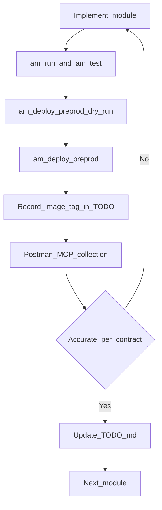
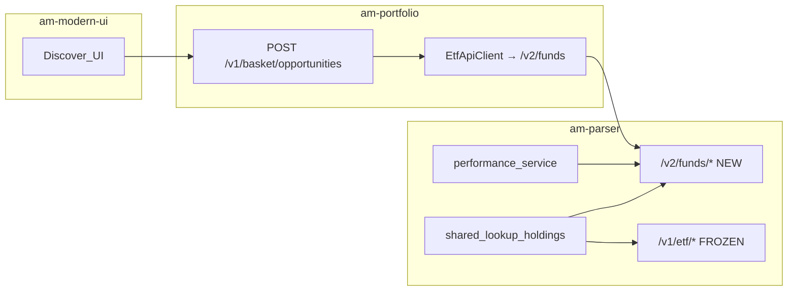

> **Index:** [README](./README.md) · [TODO.md](./TODO.md) (checkboxes only) · [fixtures/](./fixtures/) · [architecture.drawio](./architecture.drawio)

# Smart Baskets Discover — Multi-Service Plan (v2 Funds API)

## Plan quality scorecard (senior review)

| Area | Score /10 | Notes |
|------|-----------|--------|
| API contract (v1 freeze + v2 funds) | 10 | Frozen v1 + v2 funds; Postman assert contract locked below |
| Service boundaries | 10 | Parser SoT; portfolio maps; UI consumes; no market-data edits |
| Design / web-mobile parity | 10 | Field map + UX locks; chrome out of scope by design |
| Delivery / amctl alignment | 10 | Live CLI: dry-run, via, doctor, quality-bar, one-click recipe |
| Test / one-click loop | 10 | Exact asserts + URL matrix + rollback; ticks live in TODO |
| Docs PLAN vs TODO split | 10 | PLAN = contracts; TODO = checkboxes + UIDs + image tags |
| Completeness of phases | 10 | Phases 0–10 + DoD includes runtime evidence gates |
| Observability / ops | 10 | SLOs, fail-open, fixtures, deploy order, rollback |

**Overall: 10/10 (specification).** Runtime proof (Postman UIDs filled, one-click rows checked, image tag noted) is tracked only in [TODO.md](./TODO.md) — absence of ticks does not reopen design.

### Spec closure (was the prior 0.5 gap)

Locked in this document: preprod URL matrix, Postman accuracy contract, SLOs/budgets, golden fixture paths, rollback commands, DoD requiring TODO evidence. Implementers execute those gates; they do not invent new acceptance rules.

---

## Document split

| File | Role |
|------|------|
| This PLAN | Strategy, contracts, amctl/Postman/identity, one-click recipe — **no checkbox lists** |
| [TODO.md](./TODO.md) | Actionable checkboxes — **update after every phase** |

**Credentials:** `POSTMAN_API_KEY` in `~/.asrax/credentials.env` (you maintain). Never commit keys or JWTs.

**Blockers removed:** Do not wait for Postman collections before coding. Implement first; collections and one-click tests run in parallel or right after each module.

---

## Delivery operations (amctl + Postman + identity)

Follow skill **amctl**: prefer live `am --help` / `am deploy -h` / `am run -h` / `am test -h`. Always run commands from the directory that contains `.am.yaml`.

### Preconditions

```powershell
am creds doctor
am deploy doctor
```

Remote config = Vault. Laptop secrets = `~/.asrax/credentials.env` only.

### am-parser (`am-market/am-parser`)

Monorepo GitHub: **AM-Portfolio/am-market**, service `am-parser`, `deploy.via: helm`, `rebuild: on-change`.

```powershell
cd am-market\am-parser
am run
am test
am deploy --env preprod --dry-run
am deploy --env preprod
# optional: --via helm | --via actions | --rebuild (only when needed)
```

### am-portfolio

```powershell
$env:JAVA_HOME = "C:\Program Files\Android\Android Studio\jbr"
cd am-portfolio
mvn clean install -DskipTests
am test
am deploy --env preprod --dry-run
am deploy --env preprod
```

Legacy `deploy.ps1` only if user explicitly confirms. Host `ETF_API_URL` unchanged; paths become `/v2/funds`.

### am-modern-ui

Repo-native Flutter run/test; verify against preprod APIs after portfolio module is green.

### Postman MCP

1. Key in credentials.env; Cursor `postman` → `postman-mcp.cmd`.
2. Collections A (parser) / B (portfolio) in parallel with coding.
3. Envs: parser local/preprod, portfolio preprod + Bearer.
4. UIDs recorded in TODO.md.

### Identity

| Item | Value |
|------|--------|
| Host | `https://am-preprod.asrax.in/identity` |
| Keycloak | `https://auth.asrax.in/auth` realm **`am-preprod-realm`** |
| Usage | Fresh access token → Postman `{{bearerToken}}` for Collection B |
| Rule | Never commit JWTs; rotate in TODO only as “obtained / expired” status |

### Preprod URL matrix

| Service | Base URL | Notes |
|---------|----------|--------|
| am-parser | `https://am-preprod.asrax.in/parser` | Same host as `ETF_API_URL` |
| am-portfolio | `https://am-preprod.asrax.in/portfolio` | Basket APIs under `/v1/basket/...` |
| Identity | `https://am-preprod.asrax.in/identity` | Token for Collection B |
| Local parser | `http://localhost:8022` (or service port from `.am.yaml`) | Collection A local env |

Paths (relative to parser base):

- Frozen: `POST /v1/etf/holdings`, `GET /v1/etf/search`, `GET /v1/etf/holdings/bulk`
- New: `POST /v2/funds/holdings`, `GET /v2/funds/search`, `GET /v2/funds/holdings/bulk`, `POST /v2/funds/performance/batch`, `POST /v2/funds/performance/refresh`

### Postman accuracy contract

**Collection A — AM Parser Funds v2** (no auth unless env requires)

| Request | Pass when |
|---------|-----------|
| `POST /v1/etf/holdings` `{ "items": ["NIFTYBEES"] }` | **200**; body has `etfs` (not `funds`); **no** `return1Y` / `sparklineCloses` required; shape matches fixture `fixtures/v1-holdings-niftybees.json` |
| `POST /v2/funds/holdings` `{ "items": ["NIFTYBEES"], "productTypes": ["ETF"] }` | **200**; `funds[0].productType=="ETF"`; `symbol` present; `holdings` array; `return1Y|3Y|5Y` number **or** `null`; if sparkline present length **≤24**; `notFound` excludes found symbols |
| `POST /v2/funds/holdings` MF stub `{ "items": ["ANY"], "productTypes": ["MUTUAL_FUND"] }` | **200**; `funds` empty or stub; no 5xx |
| `GET /v2/funds/search?query=NIFTY&productTypes=ETF` | **200**; results are ETF-shaped |
| `POST /v2/funds/performance/batch` | **200**; per-item returns null-ok; fail-open (no hard 500 on chart miss) |

**Collection B — AM Portfolio Basket Discover** (`Authorization: Bearer {{bearerToken}}`)

| Request | Pass when |
|---------|-----------|
| Catalog / themes (existing preprod path) | **200** |
| `POST /v1/basket/opportunities` (Discover payload) | **200**; each row may include `etfSymbol`, `categoryLabel`; `return1Y|3Y|5Y` number **or** omitted/null (UI shows `—`); never fake `0` for missing; `matchScore` present where engine returns it |
| Preview / exposure smoke | **200** or documented non-blocker error only |

“Accurate” = all rows above green for that module’s collection. Fix code and re-run one-click until true; then tick TODO.

### SLOs / budgets (Discover path)

| Budget | Lock |
|--------|------|
| Sparkline | Max **24** closes; omit/empty → UI hides chart |
| Performance cache TTL | **6h** (parser); refresh idempotent |
| Charts source | Always market-data **`range=5Y`**, slice 1Y/3Y client-side in parser; do not rely on `range=3Y` |
| Fail-open | Chart/perf miss → holdings still **200** with null returns |
| Preprod `POST /v2/funds/holdings` | p95 **≤ 3s** for ≤10 symbols (warm cache preferred) |
| Preprod `POST /v2/funds/performance/batch` | p95 **≤ 2s** for ≤20 symbols when cache warm |
| Portfolio opportunities | Must not fail solely because Redis/perf unavailable (L1 / live enrichment) |

### Golden fixtures

Store under [`docs/feature-basket/fixtures/`](./fixtures/) (committed JSON; no secrets):

| File | Purpose |
|------|---------|
| `v1-holdings-niftybees.json` | Frozen v1 response sample for Collection A regression |
| `v2-holdings-niftybees.json` | v2 response sample including nullable performance fields |
| `v2-performance-batch-sample.json` | Lightweight batch shape |

Create/update fixtures when Module 1 responses stabilize; Postman tests may deep-equal or assert subset against these.

### Rollback

After each successful preprod deploy, record **image tag** (or digest) in TODO.

If preprod is broken:

1. Redeploy previous known-good tag via `am deploy --env preprod` (same service dir with prior tag / helm rollback per amctl service docs).
2. Or `kubectl rollout undo` for that service’s Deployment in the preprod apps namespace (confirm release name from `.am.yaml`: `am-parser` / portfolio release).
3. Re-run Collection A or B; tick TODO “rollback verified” if used.

### One-click testing (after each module)

1. Bearer if portfolio  
2. `am run` + `am test` / unit (am-quality-bar)  
3. `am deploy --env preprod --dry-run` then deploy; **write image tag to TODO**  
4. Postman A or B until **accuracy contract** rows pass  
5. Fix loop; then update TODO.md  
6. Rollback per above if preprod broken  



### Coding + ops guidelines

- Skills/rules: am-match-repo, am-coding-standards, am-quality-bar, am-secrets, am-runtime-vault, am-service-api
- Freeze `/v1/etf/*`; `/v2/funds/*` only; no new context-path
- Fail-open returns; batch charts/cache; sparkline ≤24; idempotent refresh
- Stable error JSON; structured logs (no secrets)
- Do not claim done until checks run or explicitly “not verified”
- Deploy order: parser → portfolio → UI

---

## Executive summary

Ship Discover (desktop + mobile) with performance, ticker, category, Top picks, and All baskets.

**API strategy (locked):**

- **Do not change** existing `POST /v1/etf/holdings` or other `/v1/etf/*` responses — full **backward compatibility** for current dependents.
- Introduce **v2 fund APIs** under `/v2/funds/*` designed for **`productType: ETF | MUTUAL_FUND`**, including 1Y/3Y/5Y performance.
- Contract is a **superset of v1 holdings shape** so dependents switch by changing base path + reading `funds[]` (with aliases) — minimal client change.
- Discover v1 build: **ETF fully implemented on v2**; **MF productType reserved** (empty/not_found until MF phase).

**Ownership / scope of this plan:** **am-parser** (v2 funds + performance), **am-portfolio** (client → v2 + opportunities), **am-modern-ui** (Discover). No am-market-data work; no new server context-path.

---

## Backward compatibility rule

| Surface | Rule |
|---------|------|
| `POST /v1/etf/holdings` | **FROZEN** — same request/response as today; no performance fields; ETF-only |
| `GET /v1/etf/search` | **FROZEN** |
| `GET /v1/etf/holdings/bulk` | **FROZEN** |
| All other `/v1/etf/*` | **FROZEN** |
| `/v2/funds/*` | **NEW** — ETF + MF-ready + performance |
| Deprecation | v1 remains supported; no removal in this program. Mark docs: “prefer v2 for new work” |

Internal implementation may share lookup/holdings services between v1 and v2; **HTTP contracts stay separate**.

---

## v2 Fund contract (migration-friendly)

### Design goals

1. One resource model for ETF and mutual fund.
2. Easy switch from v1: same identifiers (`items`), same holding row fields, additive performance + `productType`.
3. Portfolio/AI/other services change **URL + list key**, not rewrite domain logic.

### Namespace

```text
/v2/funds/...
```

Not under `/v2/etf/...` — name is product-neutral.

### Core types (camelCase JSON in OpenAPI; accept snake_case aliases on input if needed)

```text
productType: "ETF" | "MUTUAL_FUND"

FundSummary {
  productType
  symbol          // ETF ticker; MF scheme code / symbol when available
  name
  isin            // nullable for some MFs
  assetClass      // optional
  categoryLabel   // optional theme/category
  return1Y, return3Y, return5Y   // nullable Double
  returnsAsOf                    // nullable ISO date
  sparklineCloses                // nullable number[<=24]
}

FundHoldingRow {                 // SAME semantics as v1 ApiHolding
  stockName / stock_name
  isinCode / isin_code
  percentage
  marketValue / market_value    // optional
  quantity                      // optional
}

FundDocument extends FundSummary {
  holdings: FundHoldingRow[]
  holdingsCount
}
```

### Endpoints

| Method | Path | Purpose |
|--------|------|---------|
| `POST` | `/v2/funds/holdings` | Batch lookup by symbols/ISINs/names — **v2 successor to** `POST /v1/etf/holdings` |
| `GET` | `/v2/funds/search` | Search — successor to `GET /v1/etf/search` |
| `GET` | `/v2/funds/holdings/bulk` | Warmup/compressed map — successor to bulk |
| `POST` | `/v2/funds/performance/batch` | Performance-only batch (lightweight) |
| `POST` | `/v2/funds/performance/refresh` | Ops/async refresh (ETF charts now; MF NAV later) |

### Request — holdings (v2)

```json
{
  "items": ["NIFTYBEES", "BANKBEES"],
  "productTypes": ["ETF"]
}
```

- `productTypes` omitted → default **`["ETF"]`** in Discover era (safe); later default can become both once MF data exists.
- MF phase: `["MUTUAL_FUND"]` or `["ETF","MUTUAL_FUND"]`.

### Response — holdings (v2)

```json
{
  "items": ["NIFTYBEES"],
  "totalFound": 1,
  "funds": [
    {
      "productType": "ETF",
      "symbol": "NIFTYBEES",
      "name": "...",
      "isin": "...",
      "holdings": [{ "stock_name": "...", "isin_code": "...", "percentage": 8.2 }],
      "holdingsCount": 50,
      "return1Y": 12.3,
      "return3Y": 45.0,
      "return5Y": 80.1,
      "returnsAsOf": "2026-09-04",
      "sparklineCloses": [190.0, 195.2, 273.27]
    }
  ],
  "notFound": []
}
```

**Migration aliases (optional but recommended for zero-friction switch):**

- Response may also include `etfs` as a **deprecated alias** equal to `funds` filtered to `productType=ETF` for one release — **or** document that clients rename `etfs` → `funds` only.
- **Chosen default:** primary key is **`funds` only** (cleaner). Portfolio client uses Jackson `@JsonAlias` / dual field reader for one release if needed.
- Holding row keeps **both** camelCase and existing snake_case via aliases so [`EtfApiClient.ApiHolding`](am-portfolio/portfolio-basket/src/main/java/com/portfolio/basket/client/EtfApiClient.java) mapping stays almost unchanged.

### Side-by-side: v1 vs v2

| Concern | v1 `POST /v1/etf/holdings` | v2 `POST /v2/funds/holdings` |
|---------|----------------------------|------------------------------|
| Products | ETF only | ETF + MUTUAL_FUND |
| List key | `etfs` | `funds` |
| Performance | No | Yes (nullable) |
| `productType` | Implicit ETF | Explicit |
| Breaking for old clients | N/A — unchanged | New path only |

### Switch checklist for other dependents (non-portfolio)

1. Change path `/v1/etf` → `/v2/funds`.
2. Map list `funds` (was `etfs`).
3. Read optional performance; ignore nulls.
4. Send `productTypes: ["ETF"]` until MF ships.
5. Keep same parser host (`ETF_API_URL`).

Services that stay on v1 need **zero** changes.

---

## am-portfolio uses v2 — full wiring (detailed)

**Decision:** After parser v2 ships, **am-portfolio stops calling `/v1/etf/*` for basket discover/engine paths** and calls **`/v2/funds/*` only**. Host stays `etf.url` / `ETF_API_URL`. Vault mapping does not need a new host secret.

### Today (before change)

```text
ETF_API_URL / etf.url  (e.g. https://am-preprod.asrax.in/parser)
        │
        ▼
EtfApiClient (@Value etf.url)
  POST {etf.url}/v1/etf/holdings     ← lookupHoldings
  GET  {etf.url}/v1/etf/search       ← searchEtfs / isEtf / resolveQuery
        │
        ▼
EnrichedEtfService.getEnrichedEtfsBatch
        │
        ▼
BasketEngineService.findOpportunities
BasketAllocationService (exposure)
```

Concrete code today:

- Config: [`application.yml`](am-portfolio/portfolio-app/src/main/resources/application.yml) `etf.url: ${ETF_API_URL:http://localhost:8022}`
- Client: [`EtfApiClient.java`](am-portfolio/portfolio-basket/src/main/java/com/portfolio/basket/client/EtfApiClient.java)
  - `lookupHoldings` → `apiUrl + "/v1/etf/holdings"` (line ~129)
  - search → `apiUrl + "/v1/etf/search?..."` (lines ~207, ~343)
  - Response DTO list field: `etfs` (`HoldingsLookupResponse`)
- Engine: [`BasketEngineService`](am-portfolio/portfolio-basket/src/main/java/com/portfolio/basket/service/BasketEngineService.java) → `enrichedEtfService.getEnrichedEtfsBatch`
- No performance fields on opportunity today

### Target (portfolio on v2)

```text
ETF_API_URL / etf.url  (UNCHANGED host)
        │
        ▼
EtfApiClient (same bean name OK) OR rename FundApiClient
  POST {etf.url}/v2/funds/holdings
       body: { "items": [...], "productTypes": ["ETF"] }
  GET  {etf.url}/v2/funds/search?query=...&productTypes=ETF
  POST {etf.url}/v2/funds/performance/batch   ← only if holdings omit returns
        │
        ▼
Parse response.funds[]  (not etfs)
Copy return1Y/3Y/5Y, sparklineCloses, returnsAsOf → EtfData
        │
        ▼
EnrichedEtfService (unchanged call sites)
        │
        ▼
BasketOpportunity: etfSymbol + returns + categoryLabel
POST /v1/basket/opportunities  (portfolio API — still /v1/basket)
```

### Exact client edits in portfolio

| Method | Old URL | New URL | Request body change |
|--------|---------|---------|---------------------|
| `lookupHoldings` | `POST /v1/etf/holdings` | `POST /v2/funds/holdings` | Add `"productTypes": ["ETF"]`; keep `items` |
| `searchEtfs` / resolve | `GET /v1/etf/search` | `GET /v2/funds/search` | Query param `productTypes=ETF` (or repeat) |
| Bulk warmup (if used) | `GET /v1/etf/holdings/bulk` | `GET /v2/funds/holdings/bulk` | Filter ETF |
| Performance fallback | — | `POST /v2/funds/performance/batch` | `{ "items": [...], "productTypes": ["ETF"] }` |

**Response parsing:**

| v1 field | v2 field | Jackson approach |
|----------|----------|------------------|
| `etfs` | `funds` | Rename property to `funds`; optional `@JsonAlias("etfs")` only if dual-read needed during rollout |
| `total_found` | `totalFound` | Keep `@JsonProperty("total_found")` **and** accept `totalFound` via `@JsonAlias` |
| `not_found` | `notFound` | Same alias pattern |
| holding `stock_name` | same / `stockName` | Keep existing `@JsonProperty("stock_name")` + alias |
| — | `productType` | New on `EtfApiResponse` / Fund DTO; assert `ETF` for basket |
| — | `return1Y`, `return3Y`, `return5Y`, `returnsAsOf`, `sparklineCloses` | New on `EtfApiResponse` → `EtfData` → `BasketOpportunity` |

**Request DTO change:**

```java
// HoldingsLookupRequest today: { items }
// v2:
{ "items": ["NIFTYBEES"], "productTypes": ["ETF"] }
```

### Config (portfolio) — concrete

**No new YAML / context-path / `api-version-path`.** Keep only existing:

```yaml
etf:
  url: ${ETF_API_URL:http://localhost:8022}
```

In [`EtfApiClient`](am-portfolio/portfolio-basket/src/main/java/com/portfolio/basket/client/EtfApiClient.java), hard-change string paths:

- `"/v1/etf/holdings"` → `"/v2/funds/holdings"`
- `"/v1/etf/search"` → `"/v2/funds/search"`
- bulk similarly if used

Roll-back = redeploy previous portfolio image (or revert those path strings). No feature-flag path config in this plan.

### What portfolio does NOT change

| Piece | Notes |
|-------|-------|
| `POST /v1/basket/opportunities` path | Still portfolio’s own API |
| `GET /v1/basket/catalog` | Unchanged |
| `POST /v1/basket/exposure` | Still uses enriched batch; after switch, batch comes from v2 |
| Vault host `ETF_API_URL` | Same parser host; **no new context-path** |

### Call-site coverage (all must hit v2 after switch)

| Caller | Via | Must use v2 |
|--------|-----|-------------|
| `BasketEngineService.findOpportunities` | `EnrichedEtfService` → `EtfApiClient` | Yes |
| `BasketAllocationService` exposure | same | Yes |
| Search / `isEtf` / keyword resolve | `EtfApiClient` search | Yes |
| Cache warmup jobs using bulk | bulk endpoint | Yes if present |

### Opportunities response (portfolio → UI) after map

```json
{
  "etfIsin": "...",
  "etfName": "...",
  "etfSymbol": "NIFTYBEES",
  "categoryLabel": "Nifty 50 · Equity",
  "matchScore": 0.82,
  "return1Y": 12.3,
  "return3Y": 45.0,
  "return5Y": 80.1,
  "sparklineCloses": [190.0, 273.27],
  "returnsAsOf": "2026-09-04",
  "minimumInvestmentAmount": 15000.0
}
```

Flutter never calls parser; it only reads this opportunities JSON.

### Portfolio Phase 3 checklist (expanded)

1. Hardcode `EtfApiClient` paths to `/v2/funds/...` (no new config keys).
2. `lookupHoldings` body add `productTypes: ["ETF"]`; parse `funds[]`.
3. Change search URLs to `/v2/funds/search`.
4. Extend `EtfApiResponse` / `EtfData` / `BasketOpportunity` with performance + `etfSymbol`.
5. Map performance in overlap builder or post-pass mapper (fail-open).
6. Unit tests: mock v2 JSON with `funds` + returns; mock null returns; engine still sorts by match.
7. Do **not** leave a second code path calling `/v1/etf/holdings` in basket module after cutover.

---

## Service ownership diagram



---

## API inventory (final)

**Out of plan:** am-market-data — not listed; no edits, no new paths.

### am-parser

| API | Change |
|-----|--------|
| `/v1/etf/*` (all) | **NO CHANGE** — frozen |
| `POST /v2/funds/holdings` | **NEW** |
| `GET /v2/funds/search` | **NEW** |
| `GET /v2/funds/holdings/bulk` | **NEW** |
| `POST /v2/funds/performance/batch` | **NEW** |
| `POST /v2/funds/performance/refresh` | **NEW** (ops) |

**Code layout (suggested):**

- `am_api/routers/funds_v2.py` — v2 routes
- `am_api/schemas/fund_v2.py` — OpenAPI models
- `am_etf/performance_service.py` — ETF returns from charts
- Reuse `lookup_service` / holdings for ETF branch; MF branch stub returns `notFound` until Phase 8

### am-portfolio

| API | Change |
|-----|--------|
| `POST /v1/basket/opportunities` | **UPDATE response** — `etfSymbol`, `categoryLabel`, returns, sparkline, asOf |
| Catalog / exposure / preview / create | **EXISTING** / no contract break |

**Client:** evolve [`EtfApiClient`](am-portfolio/portfolio-basket/src/main/java/com/portfolio/basket/client/EtfApiClient.java) → `FundApiClient` calling `/v2/funds/holdings` with `productTypes: ["ETF"]`. Keep class methods `lookupHoldings` signatures; change path + parse `funds`.

### am-modern-ui

Unchanged vs prior plan: consume enriched opportunities only; no direct parser/market calls for returns.

---

## Design parity analysis (desktop mock vs plan)

**Verdict:** Backend+v2 fields in the plan cover **data** for the mock. UI phases were too thin for full visual parity. This section locks every mock control to data + implementation so the plan **can** ship the design.

**Scope of chrome:** Mock shows Zerodha sidebar / global search / New Trade. **Do not rebuild app shell.** Only the **Smart Baskets Discover content** (title → filters → Top picks → All baskets) inside existing AM portfolio web/mobile hosts. Use `am_design_system` / `ModuleColors.portfolio` — not mock magenta-as-brand if DS already defines portfolio accent.

### Desktop mock → field / behavior map

| Mock UI element | Data / behavior source | Plan coverage |
|-----------------|------------------------|---------------|
| Title “Smart Baskets” + subtitle | Static copy in explorer | Add explicit copy in P6 |
| Discover / My Baskets toggle | `BasketNavigation.viewMode` | Existing — keep |
| Theme chips (Top picks, Nifty 50, Bank, …) | `GET /catalog` themes + defaultQuery | Existing + matrix |
| 1Y / 3Y / 5Y / All | Client period → `return1Y\|3Y\|5Y` | Parser v2 + opportunity map |
| Sort by Recommended | Client sort modes | DiscoverViewState |
| Clear all | Reset theme+query+period+sort | Matrix |
| Section “Top picks” + **View all** | `displayList.take(3)`; View all scrolls to table | Explicit P6 |
| Card: category chip (IT - Equity) | `categoryLabel` | Portfolio map from theme |
| Card: name + ticker | `etfName` + `etfSymbol` | v2 + opportunity |
| Card: colored icon / logo | **No logo API** | **Initials / DS icon placeholder** (v1) |
| Card: bookmark | No API | **Hide** (v1) |
| Card: sparkline | `sparklineCloses` | v2 performance |
| Card: Portfolio match ring + held/missing | `matchScore`, `heldCount`, `missingCount` | Existing overlap |
| Card: “+18.42% 1Y return” | Selected period return | Client period |
| Card: N constituents | `totalItems` | Existing |
| Card: ₹x.xL required | `minimumInvestmentAmount` → Lakh format | Wire (already on DTO) |
| Card: Preview → | `openPreview` + telemetry | Existing |
| All baskets count “24 baskets” | `displayList.length` | P6 |
| Table columns: Basket/ETF, Category, Constituents, Match, {period} return, Required, Preview | Same fields | P6 table |
| Table row ⋮ menu | No actions defined | **Omit** (v1) |
| Search ETFs… | Existing `EtfSearchBar` (single→preview, multi→query) | Preserve |
| FoF rows in mock | Still ETF/fund product via parser when available | Category label only; not MF productType in v1 |

### Gaps closed by this update

| Gap in prior plan | Resolution |
|-------------------|------------|
| Thin P5–P7 UI | Pixel-intent specs + mobile section + dos/donts |
| Logo / bookmark / ⋮ | Explicit don’ts for v1 |
| View all / Clear all / As of | Required behaviors |
| Lakh formatting / period column header sync | Required |
| Testing only “QA” | **Phase 8 Testing** with cases |
| Shell redesign | Explicit don’t |

---

## Mobile Discover (required layout)

Breakpoint: `maxWidth < AmBreakpoints.mobile` (600).

| Desktop | Mobile |
|---------|--------|
| Inline Discover / My Baskets | Sticky `BasketModeToggle` in portfolio header (`showInlineToggle: false`) |
| One filter band | Theme chips horizontal scroll; **Performance 1Y/3Y/5Y/All** row; Sort trailing or sheet |
| Top picks 3-col cards | Optional “Top picks” label; **same card widget**, stacked (or first 3 then “All”) |
| All baskets **DataTable** | **No table** — vertical **dense cards** for full `displayList` |
| Table meta | Meta line: `{N} baskets · As of {returnsAsOf}` |
| Preview | Full-width card CTA |

Mobile card must show: name, ticker, category, match ring + held/missing, period return (or `—`), constituents, required ₹, Preview. Sparkline if space; omit if cramped.

---

## UI guidelines (do / don’t)

### Do

- Use **`am_design_system`** tokens only (`ModuleColors.portfolio`, `AppSpacing`, `AppRadii`, `context.statusSuccess` / `statusError` for returns).
- Keep **first desktop viewport**: filters + Top picks (3) + start of All baskets table (minimal scroll).
- Sync **period control** with card return label **and** table column header (`1Y return` / `3Y` / `5Y` / All→prefer 5Y).
- Use **`matchScore`** on both web and mobile (not replicaScore).
- Format investment as **₹X.XL** / crore helper consistent with app.
- Null returns / empty sparkline → **`—`** / hide chart.
- Preserve search→preview, My Baskets, nested navigator, `basket_open_preview` telemetry.
- Fail-open: missing performance still shows match + required + Preview.
- Extract widgets: filter bar, top picks, all baskets table, opportunity card, view state.

### Don’t

- Don’t change **`/v1/etf/*`** parser APIs.
- Don’t add **new context-path** or `api-version-path` YAML; hardcode `/v2/funds` in client.
- Don’t call market-data charts from **portfolio or Flutter** for Discover returns.
- Don’t rebuild **sidebar / global cmd+K / Zerodha chrome** from the mock.
- Don’t ship **fake bookmarks** or **⋮ menus** without backend.
- Don’t use **wide DataTable on mobile**.
- Don’t show **`0%`** for missing returns.
- Don’t hardcode theme chip lists — catalog-driven.
- Don’t introduce a second purple theme; follow DS portfolio accent.
- Don’t block opportunities HTTP on performance failure.
- Don’t implement **MF Discover** UI labels as primary in v1 (ETF copy OK); v2 API ready only.

---

## Discover UX locks (product)

- Top picks = first **3** of **sorted** `displayList`; All baskets = full list.
- Performance / Sort = **client-only** (no opportunities refetch).
- Theme / multi-ISIN search / clear = refetch per matrix.
- Bookmark hide; View all = scroll to All baskets (desktop).
- Web ≥600: 3-col Top picks + table. Mobile &lt;600: dense cards + As of.

---

## Remaining UI work (post-PROD API) — 2026-09-06

**APIs:** PROD green (parser `funds-v2-mdurl-20260906`, portfolio `basket-discover-cachefix-20260906`; Newman 47/47).  
**UI:** Incomplete vs mocks. Live page still uses **two card grids** (Top picks + All baskets look identical when N≤3).

**Full layout + gap matrix + executable TODO:** [discover-ui-layout-and-todo.md](./discover-ui-layout-and-todo.md)

| Gap | Mock | Current |
|-----|------|---------|
| All baskets layout | DataTable | Duplicate card grid |
| View all | Scroll to table | Absent |
| Clear all | Reset filters | Absent |
| Sort label | Sort by Recommended | Icon-only popup |
| Sparkline | On cards | Not rendered |
| Subtitle | Under title | Absent |
| Return / ₹L polish | Strong +X%, ₹X.XL | Muted / K under 1L |

**Do not** rebuild shell; **hide** bookmark/⋮; DS tokens only.

---

## Branches

| Repo | Branch | Notes |
|------|--------|-------|
| am-market (am-parser) | `hotfix/funds-v2-performance` | from `origin/main` (AM-Portfolio/am-market) |
| am-portfolio | `hotfix/basket-discover-enrich` | from `origin/main` |
| am-modern-ui | `hotfix/basket-discover-ui` | from `origin/main` |

Deploy order: **parser → portfolio → UI**.

---

## Phase-by-phase implementation

Narrative only — checkboxes live in [TODO.md](./TODO.md).

### Phase 0 — Contract freeze

Publish v2 OpenAPI field list; document v1 frozen; camelCase on opportunities; snake aliases on holding rows.

### Phase 1 — am-parser `/v2/funds` + ETF performance

Implement routers/schemas; ETF performance compute + store; MF stub; **do not touch** `/v1/etf/*`; unit tests for math/fail-open/v1 regression.

### Phase 2 — Parser one-click gate

`am run` / `am test` → `am deploy --env preprod` → Postman Collection A until accurate → update TODO.

### Phase 3 — am-portfolio → v2

Hardcode `/v2/funds` in `EtfApiClient`; parse `funds` + returns onto opportunities; JBR build; no `/v1/etf` left in basket module.

### Phase 4 — Portfolio one-click gate

Deploy preprod → identity Bearer → Postman Collection B → update TODO.

### Phase 5 — UI models + filters — **DONE (baseline)**

Branch `hotfix/basket-discover-ui`: parse opportunity fields; `DiscoverViewState` (period/sort); theme chips; period chips; sort popup; search→preview preserved. **Not** full mock parity.

### Phase 6 — Desktop Discover parity — **REMAINING**

Mocks: [basket-design-web.png](./basket-design-web.png). Spec: [discover-ui-layout-and-todo.md](./discover-ui-layout-and-todo.md).

Must ship:

- Subtitle under Smart Baskets
- Labeled **Sort by Recommended** (+ Match / Return / Required)
- **Clear all** (theme→default, period→1Y, sort→Recommended, clear search)
- Top picks header (“Handpicked…”) + **View all →** scroll to table
- Cards: category chip, **sparkline**, strong period return, ₹L required, **Preview →**
- **All baskets = DataTable** (Basket/ETF, Category, Constituents, Match, {period} return, Required, Preview); period column header syncs with period control
- No bookmark / no ⋮

### Phase 7 — Mobile Discover parity — **REMAINING**

Mock: [basket-mobile-screen.png](./basket-mobile-screen.png).

Must ship: sticky Discover/My Baskets; Performance row + Sort; meta `{N} baskets · As of …`; **dense vertical cards only** (no DataTable); same fields as desktop (sparkline if space).

### Phase 8 — Cross-module verification

Re-run Postman/Newman PROD (or Collections A+B); desktop/mobile acceptance vs both PNGs; tick TODO Module 3 done.

### Phase 9 — PRs / deploy

Open PRs when user asks; deploy order parser → portfolio → UI.

### Phase 10 — Mutual fund data (later)

Fill MF behind same `/v2/funds/*`. Out of Discover ETF UI delivery.

---

## Done definition

- v1 `/v1/etf/*` unchanged and regression-tested (Postman A + fixture)
- v2 `/v2/funds/*` live for ETF + performance; MF productType accepted (stub OK)
- Portfolio on v2; opportunities expose Discover fields (Postman B)
- Desktop + mobile match design map
- **TODO evidence:** Collection A/B UIDs filled; each module one-click rows checked; last good **image tag** recorded per service
- Postman accuracy contract rows green on preprod
- MF product data deferred

## Out of scope

No am-market-data code changes; no new context-path; no logo CDN / bookmark API / shell rebuild; no MF Discover UI as primary in v1.

